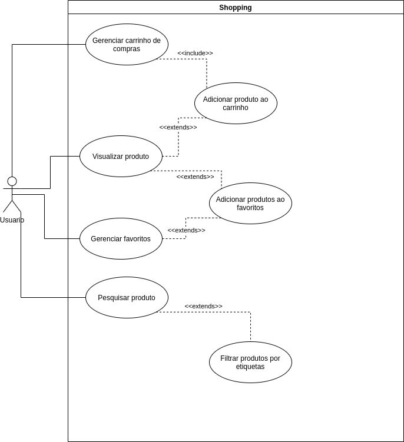

# Casos de Uso 

## Gerenciamento de Usuários de Produtos
- Efetuar Login ([CSU00](./CSU00.md)).
- Manter Usuário ([CSU01](./CSU01.md)).
- Manter Produtos ([CSU02](./CSU02.md)).
- Manter Estoque ([CSU04](./CSU04.md)).
- Efetuar Registro([CSU03](./CSU03.md)).
- Efetuar Login ([CSU00](./CSU00.md)).

## Shopping 
- Gerenciar carrinho de compras ([CSU06](./CSU06.md)).
- Visualizar produto ([CSU05](./CSU05.md)).
- Gerenciar favoritos ([CSU07](./CSU07.md)).
- Pesquisar produto ([CSU08](./CSU08.md)).

